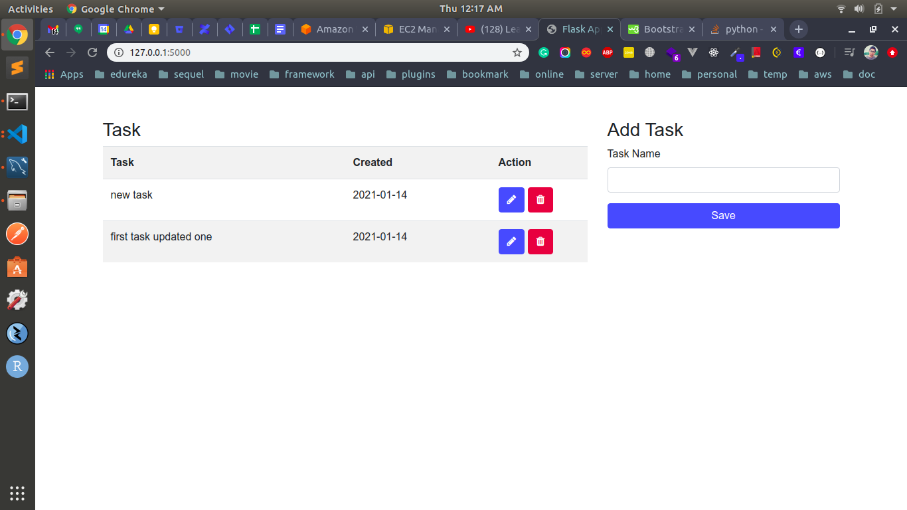

# Overview
This is just a dummy app to learn flask

# Snapshot
Index Page

# Commands

to install virtual environment
> pip install virtualenv

create a new virtual environment
> virtualenv env

activate this newly created environment
> source env/bin/activate

install flask
> pip3 install flask flask-sqlalchemy

run app
> python3 app.py

import db
> python3
> from app import db

create the database and table
> db.create_all()